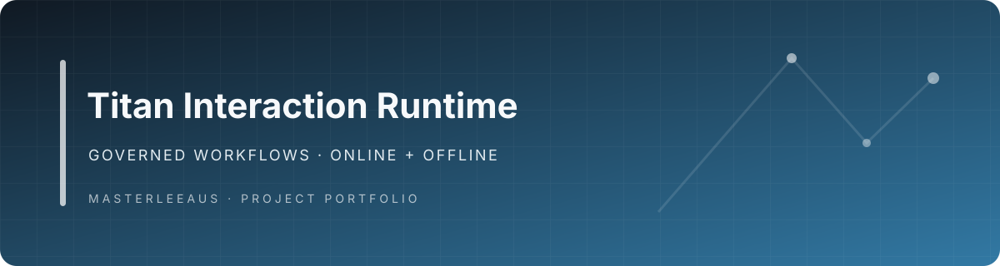

<div align="center">

# Titan Zero Interaction Engine

**A governed workflow runtime that keeps model proposals separate from authorized actions.**

</div>

[](https://github.com/Masterleeaus/Interaction-engine/actions/workflows/authority-policy-eval.yml)

## Run a governed action in five minutes

The standalone policy package and demo need PHP 8.2. They do not need Composer, Laravel, a database, or an API key.

```sh
php bin/demo.php
```

The deterministic proposal is denied first. The demo then simulates a signed owner approval bound to the exact quote data, runs an in-memory draft handler, and records an audit event. That simulated approval is not proof of a real user's identity and cannot mutate a host system.

```text
Titan Zero Interaction Engine — governed quote demo
Proposal: Create a $450 carpet-cleaning quote for Jenny.
Gate before approval: DENY — A valid, scoped and unexpired human approval is required.
Owner approval: VALID
Execution: quote-demo-001 created as a draft for Jenny — AUD 450.00
Audit: capability_executed recorded for quote-demo-001
Summary: denied before approval; approved; executed once; audit entries=1
```

## Policy Engine

The Policy Engine is the execution boundary. Intent recognition, planning, recommendation, and model proposals do not confer permission. Only a registered capability handler reached after an allowed policy decision can execute an action.

- Unknown capabilities fail closed; observe, recommend, and prepare policies cannot execute.
- User-only actions require a human identity and roles from trusted server context, with fresh authentication when configured. The host must not copy identity claims from request or model data.
- Delegated actors must be identified, tenant scoped, and carry every required scope.
- Approval grants are HMAC-SHA256 signed, capability and tenant scoped, time limited, and bound to the action payload by default.
- Numeric limits and registered domain rules run before execution.

The framework independent package is in [`packages/policy-engine`](packages/policy-engine/README.md). Its `AuthorityLevel`, `CapabilityPolicy`, `ApprovalSigner`, and `PolicyEngine` classes have a focused test suite:

```sh
php packages/policy-engine/tests/run.php
```

Only trusted server-side approval code should issue grants. The host remains responsible for authenticating users, building `_context`, persisting approvals, and recording durable audit evidence.

## Current 100-case authority evaluation

`php bin/authority-eval.php` exercises 100 deterministic cases across approval-required, user-only, delegated, prepare-only, and unregistered capabilities. It reports unauthorized actions executed, valid actions wrongly blocked, attempts blocked, and an allow-gate-bypassed no-op baseline. The expected result is **0 unauthorized actions executed** and **0 valid actions wrongly blocked**.

CI stores the JSON report with the run artifacts. A committed report for this branch will be added after the PHP workflow has executed on the implementation commit. The earlier 31-case evaluation and its exact historical results remain available in [`eval-results/authority-policy-latest.md`](eval-results/authority-policy-latest.md); those numbers apply to the commit recorded in that report, not to this branch.

## Optional live model proposal

The optional `openai-php/client` adapter returns structured proposal data. `OpenAIActionProposer` only accepts a caller-supplied capability allowlist and rejects authority, approval, identity, tenant, scope, and idempotency fields from model output. The proposal has no handler or policy bypass; the normal Command Bus rechecks trusted context and policy before any registered handler.

```php
$proposal = $proposer->propose($userRequest, ['quotes.create']);
$commands->dispatch(
    $proposal->capability,
    $proposal->payload + ['_context' => $trustedServerContext],
);
```

Cloud AI is disabled by default. Set `INTERACTION_AI_ENABLED=true`, `INTERACTION_AI_API_KEY`, and a high-entropy `INTERACTION_APPROVAL_SECRET` (at least 32 characters) in a trusted host environment. To make one live proposal and demonstrate its denial, install the optional SDK with `composer require openai-php/client`, then run `php bin/llm-proposal-demo.php`. It never executes the proposed action. Do not put credentials in a browser, device, or model prompt.

The local-language component is a deterministic **rule-based intent parser**. It extracts supported business intents and entities; it is not a language model.

## The 80-engine library

The repository contains 80 engine contracts with matching implementations across executive, cognitive, memory, learning, planning, human interaction, AI infrastructure, and business intelligence. [`docs/ENGINE_LIBRARY_80.md`](docs/ENGINE_LIBRARY_80.md) lists each as `Implemented` or `Partial` with behavior and limits. `Implemented` means the declared operations have executable behavior within the described boundary, not production validation for every host or industry. Heuristics, in-memory stores, and host-schema integrations are labeled accordingly; no engine is listed as interface only.

## Template discovery

The catalogue has 38 definitions: 29 ready templates and nine drafts. Ready templates reference registered entry wizards and declared capabilities; drafts remain non-executable. The authenticated Laravel catalogue is available at `GET /templates`.

The [Commerce and multi-vertical template pack](docs/COMMERCE_MULTI_VERTICAL_TEMPLATE_PACK.md) covers ordering, fulfilment, inventory, returns, refunds, and vertical-specific service workflows. Incident Response and inspection corrective action are included in the assurance workflows. Host compatibility evidence is in [`reports/workcore-compatibility.json`](reports/workcore-compatibility.json); it does not claim a connected production host.

The broader implementation map in [`docs/AI_ENGINEERING.md`](docs/AI_ENGINEERING.md) distinguishes deterministic heuristics, optional cloud-model integration, policy enforcement, and host-boundary work.

## Install and verify

The Laravel-compatible module targets PHP 8.2+ and Illuminate 10, 11, or 12. In a compatible host checkout:

```sh
composer install
npm ci
php bin/verify.php
```

The verifier runs the standalone policy suite, PHP runtime and workflow suites, and TypeScript tests. GitHub Actions also runs PHP coverage, TypeScript coverage, 100 authority cases, and measured benchmarks. This development sandbox does not include PHP, so PHP results are reported only after the remote workflow completes.

The TypeScript offline companion uses IndexedDB and AES-256-GCM for device-side command storage. The test suite uses a memory adapter; browser, database, authentication, and connected-host behavior still require validation in the destination application.

## Measured performance

The benchmark scripts measure interaction-definition compilation, duplicate-command handling, and encrypted outbox enqueue/decrypt. Published results will include the CI commit, environment, sample count, p50, and p95; no values are estimated. See [`benchmarks/performance.md`](benchmarks/performance.md).

## Repository hygiene, history, and license

This repository is licensed under MIT. Generated `dist/` output and dependencies are build-only and ignored. The risky external tarball import workflow has been removed. Historical import notes and provenance remain on the [`archive/interaction-engine-history` branch](https://github.com/Masterleeaus/Interaction-engine/tree/archive/interaction-engine-history).
