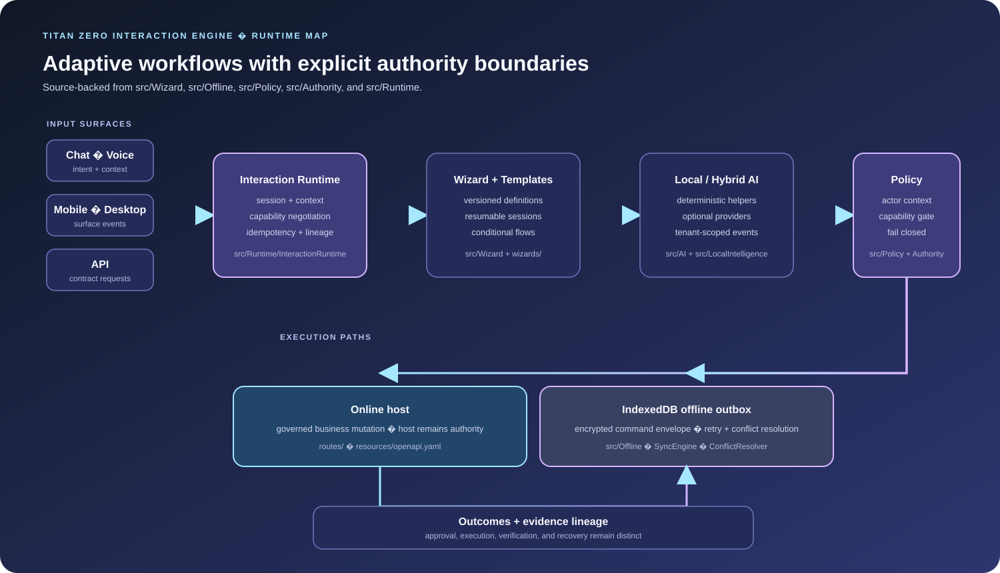

<div align="center">

# Titan Zero Interaction Engine

**A governed interaction runtime for adaptive workflows and authorised business actions, online or offline.**

</div>

[](https://github.com/Masterleeaus/Interaction-engine/actions/workflows/authority-policy-eval.yml)

## Product architecture and engineering highlights

A governed interaction runtime that turns chat, voice, mobile, desktop, and API requests into authorized, traceable business workflows.

- **Architecture:** Schema-driven wizards and versioned workflow catalogues feed local/hybrid intelligence, tenant-scoped context, capability policies, idempotent execution, and an IndexedDB-based offline companion.
- **Distinctive engineering:** The key boundary is explicit: understanding and recommending do not confer authority. Approval, execution, evidence, and verification are separate stages.

> **Status: module foundation with recorded standalone verification; host deployment readiness remains environment-specific.** The repository includes a cumulative build report and verification scripts. Its report explicitly lists host tenancy, permissions, queues, database compatibility, PWA integration, provider integration, and production-load testing as remaining destination-system checks.

## What it provides

The Interaction Engine connects chat, voice, mobile, desktop, and API experiences to structured workflows, local intelligence, business capabilities, and policy-controlled execution. Understanding user intent does not grant authority: recommendation, approval, and execution remain separate stages.

## Core capabilities

- Schema-driven Universal Wizard Engine with resumable sessions and conditional flows
- Versioned workflow and template catalogues with readiness metadata
- Local and hybrid intelligence components
- Tenant-scoped cognitive events and evidence lineage
- Capability policies, actor context, idempotency, and fail-closed execution
- TypeScript offline companion using IndexedDB and encrypted command envelopes
- OpenAPI contract in `resources/openapi.yaml`

## Template discovery

The catalogue contains 38 definitions: **29 ready templates** and nine drafts. Ready templates reference registered entry wizards and declared capabilities; drafts remain non-executable. The authenticated Laravel catalogue is available at `GET  /templates`, with template definitions discovered from `templates/`.

Assurance workflows include **Incident Response** and inspection corrective action.

### Commerce and multi-vertical template pack

The [Commerce and multi-vertical template pack](docs/COMMERCE_MULTI_VERTICAL_TEMPLATE_PACK.md) adds reusable workflows for ordering, fulfilment, inventory, returns, refunds, and vertical-specific service operations. See `reports/workcore-compatibility.json` for engine readiness and host-connection status.

## Architecture

<p align="center">
  
</p>

```text
Chat / Voice / Mobile / Desktop / API
                  |
                  v
        Interaction Runtime
                  |
                  v
          Wizard + Templates
                  |
                  v
        Local Intelligence
                  |
                  v
       Policy + Capability Layer
                  |
          +-------+-------+
          |               |
          v               v
    Online host       Offline outbox
          |               |
          +-------+-------+
                  v
          Outcomes + Evidence
```

## Technology

- PHP 8.2+
- Laravel-compatible Illuminate components
- TypeScript, IndexedDB
- PHP Sodium and AES-GCM
- OpenAPI and JSON/schema-driven definitions

## Installation

The module is intended for a compatible Laravel host. Verify the host version, dependency constraints, migrations, service provider registration, auth/tenant context, queue/cache setup, and route exposure before deployment.

```bash
composer install
npm ci
php bin/verify.php
```

`php bin/verify.php` runs the PHP suites and the TypeScript offline-companion tests. The workflow installs the declared TypeScript toolchain before invoking the same verifier, so a clean checkout does not depend on a globally installed compiler. A prior cumulative build report records historical checks; it is not a substitute for rerunning tests on the current commit or validating a destination host.

## Integration requirements

A destination system must validate:

- host-specific model and service mappings;
- tenant and permission semantics;
- authentication, API exposure, queues, cache, scheduler, and database migration compatibility;
- browser/PWA integration and cloud provider configuration;
- concurrency, load, and production failure behaviour.

The host business system remains the authority for operational mutations.

## Repository map

- `interactions/`, `wizards/`, `templates/` — interaction and workflow definitions
- `resources/ts/` — device-side offline companion
- `resources/openapi.yaml` — API contract
- `tests/` — runtime and workflow checks
- `docs/`, `reports/` — architecture and verification evidence
- [`docs/ENGINE_IMPLEMENTATION_AUDIT.md`](docs/ENGINE_IMPLEMENTATION_AUDIT.md) — source-backed scope of the 80 engine pairs and the six documented no-op methods

The AI and agent-oriented implementation map is in [`docs/AI_ENGINEERING.md`](docs/AI_ENGINEERING.md). It distinguishes deterministic heuristics, optional cloud-model integration, policy enforcement and host-boundary work from claims the repository does not make.

## Security principles

- Cloud AI is disabled by default.
- Unregistered capabilities fail closed.
- Tenant and actor context are required for consequential execution.
- Offline replay uses the same policy checks as online execution.
- Unsynchronised records remain queued until reconciliation succeeds.

## Reproducible authority policy evaluation

The authority policy claim is measured directly against `PolicyEngine` using 31 fixed, labelled scenarios covering unknown capabilities, non-executable authority levels, human roles and authentication freshness, signed approval scope and expiry, delegated scopes and numeric limits, and policy callbacks.

| Test | Allow-all bypass control | Interaction Engine |
| --- | ---: | ---: |
| Blocked requests allowed through | 24 / 24 | 0 / 24 |
| Valid requests wrongly denied | 0 / 7 | 0 / 7 |
| Wrong-tenant approvals accepted | 1 / 1 | 0 / 1 |

The baseline is a deliberately simple allow-all control, not a competing product. The evaluation tests policy decisions only; it does not cover host adapters, persistence, or downstream execution.

Evaluated on **4 October 2026** with PHP 8.2.34 at commit [`bdbe73c`](https://github.com/Masterleeaus/Interaction-engine/commit/bdbe73cc445b900d29126e081bd5f2341e98ee6f). The fixed scenario corpus uses seed `20261004` and SHA-256 `a1e863c857aa05e70f720224c3f1bb0065f2f1c699fe27e438ce4a64a58ff340`. Reproduce with:

```bash
php scripts/authority-policy-eval.php
```

The [full scenario report](eval-results/authority-policy-latest.md) records all 31 outcomes; [CI run 37171514412](https://github.com/Masterleeaus/Interaction-engine/actions/runs/37171514412) passed. The initial CI attempt failed before evaluating scenarios because the evaluator resolved the repository root one directory too high; that path bug was corrected before this successful run.

## License

The Composer package declares a proprietary license. Obtain the appropriate rights before external distribution or reuse.

## Banner

A checked-in project-specific banner is displayed above.

